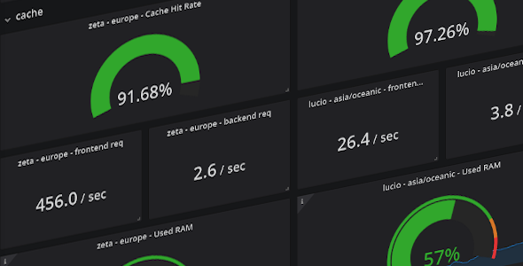
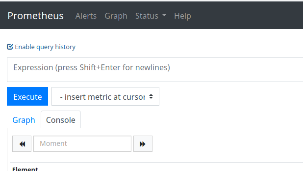
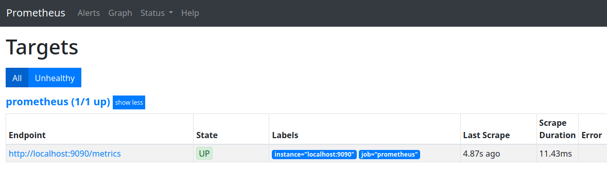
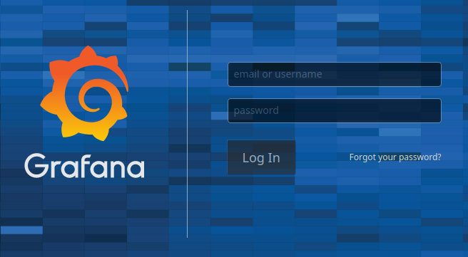
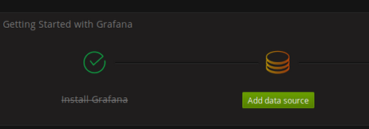
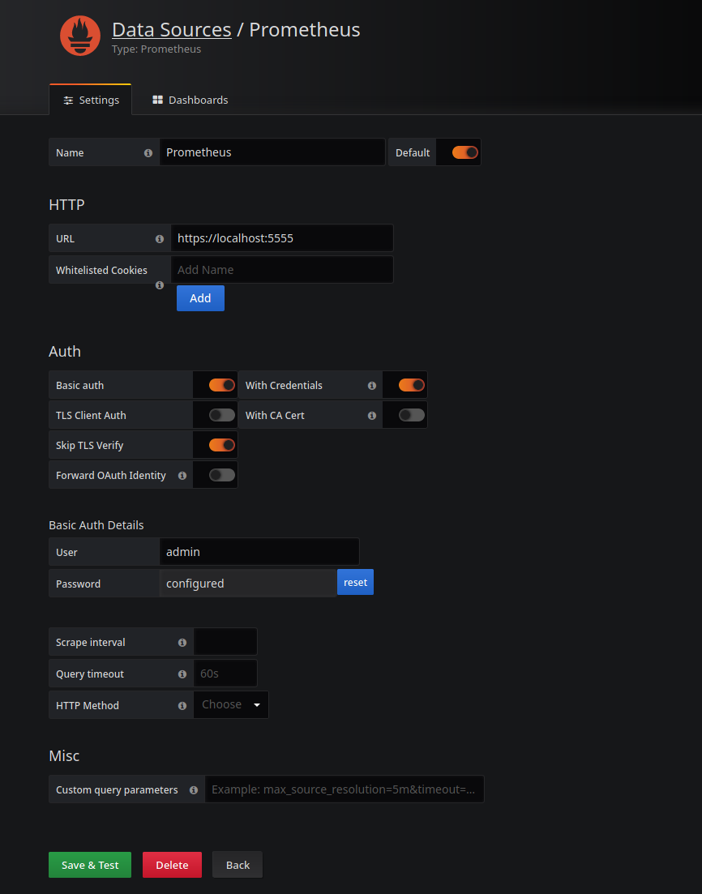
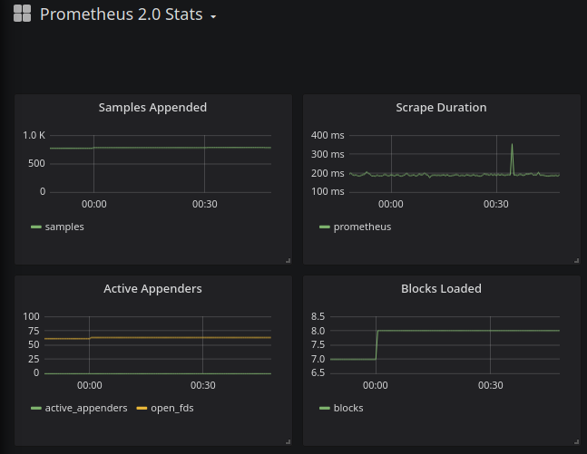

Running a remotely popular website, you'll eventually fall headfirst into a situation where a friendly user nudges you with the exciting information that the site is slow or just doesn't load. You might stumble upon the message a couple of hours after, how do you troubleshoot the past? Was it the database? Was there a hint in the nginx logs or did we suddenly choke on too many open connections? You might ask the user if they could elaborate further but this will likely in most cases not lead to the most useful information.

> 2019-08-20 20:35 Dashi: sarge burned the entire wiki down


Is there a remedy to this or are we just simply *lost* in the sea of **50GB** nginx access logs? A helpful measure is to actually keep track of everything and not just rely on your default web server logs. Furiously greping logs just to find something hidden will not always work if you're not already sure about what you're looking for.

Thanks to the combination of Prometheus and Grafana, we can take a quick look at the current status of our entire stack or during a specific time/date range.

## Prometheus
Prometheus is a monitoring system and a time-series database, which sounds perfect for our use case. It works by scraping metrics from your monitored targets, usually by HTTP endpoints. This post will assume you're using either Debian or Ubuntu but it will most likely not be very different on other distros.

First, we'll need to download the package containing Prometheus: [prometheus.io/download](https://prometheus.io/download/). You'll want the Linux amd64 version that isn't a release candidate (rc in the version name).


Let's wget it into our server.
```bash
wget https://github.com/prometheus/prometheus/releases/download/v2.14.0/prometheus-2.14.0.linux-amd64.tar.gz
```
And then we need to extract the files from the tar gzipped archive.
```bash
tar xvzf prometheus-2.14.0.linux-amd64.tar.gz
```
You'll now have a folder full of Prometheus!

Let's copy the configuration to its own folder in /etc.
```bash
cd prometheus-2.14.0.linux-amd64/
mkdir /etc/prometheus
cp -R prometheus.yml consoles/ console_libraries/ /etc/prometheus
```

Now we need to copy the executable, create a user which is isolated to /bin/false and give it permissions over the executable.
```bash
cp prometheus promtool /usr/local/bin
useradd -rs /bin/false prometheus
chown prometheus:prometheus /usr/local/bin/prometheus
```

We also need to create a writeable data folder for Prometheus, let's pick <Snippet>/opt/prometheus</Snippet> and give the user permissions.
```bash
mkdir -p /opt/prometheus/data
chown -R prometheus:prometheus /opt/prometheus/data /etc/prometheus/*
```
Now we have all the files needed, now we only lack a systemd service that will handle starting and stopping Prometheus.

Create a file named <Snippet>/lib/systemd/system/prometheus.service</Snippet> with the following contents
```bash
[Unit]
Description=Prometheus
Wants=network-online.target
After=network-online.target

[Service]
Type=simple
User=prometheus
Group=prometheus
ExecStart=/usr/local/bin/prometheus \
  --config.file=/etc/prometheus/prometheus.yml \
  --storage.tsdb.path="/opt/prometheus/data" \
  --web.console.templates=/etc/prometheus/consoles \
  --web.console.libraries=/etc/prometheus/console_libraries \
  --web.listen-address=0.0.0.0:9090 \
  --web.enable-admin-api
Restart=always

[Install]
WantedBy=multi-user.target
```
If you did everything correctly, you should be able to enable (start the service on boot) and start the service.
```text
systemctl start prometheus
systemctl enable prometheus
```
You can check if it's running with <Snippet>systemctl status prometheus</Snippet>, if it's active, you've done everything correctly so far!

We can now access the web interface at <Snippet>http://yourserverip:9090</Snippet> to see if Prometheus works.



It works! Prometheus will have one default standard monitor target, itself. We can check it out by pressing status and then targets.




Prometheus does sadly not support TLS or authentication, we can fix this by installing nginx and use it as a reverse proxy for Prometheus.
We also want to set basic auth for Prometheus and generate a certificate so everything will communicate with TLS to it.
```bash
apt-get install nginx gnutls-bin apache2-utils
```
We have now the required tools for it, let's generate a htpasswd file for nginx.
```text
htpasswd -c /etc/prometheus/.htpasswd admin
```
And now we generate the certificate we will use.
```text
mkdir /etc/ssl/prometheus
certtool --generate-privkey --outfile /etc/ssl/prometheus/prometheus-privkey.pem
certtool --generate-self-signed --load-privkey prometheus-privkey.pem --outfile /etc/ssl/prometheus/prometheus-cert.pem
```
We can now create the nginx config for our reverse proxy, create <Snippet>/etc/nginx/conf.d/prometheus.conf</Snippet> with the content:
```bash
server {
    listen 5555 ssl;
    ssl_certificate /etc/ssl/prometheus/prometheus-cert.pem;
    ssl_certificate_key /etc/ssl/prometheus/prometheus-privkey.pem;

    location / {
      auth_basic           "Prometheus";
      auth_basic_user_file /etc/prometheus/.htpasswd;
      proxy_pass           http://localhost:9090/;
    }
}
```
We will now have to go back to the systemd service file for Prometheus, <Snippet>/lib/systemd/system/prometheus.service</Snippet>.

We are changing <Snippet>--web.listen-address=0.0.0.0:9090</Snippet> to listen to only localhost with <Snippet>--web.listen-address=127.0.0.1:9090</Snippet> instead.

We're also adding <Snippet>--web.external-url=https://yourserverip:5555</Snippet> so the web interface does not get confused being behind a reverse proxy.

This is how it will look eventually:
```bash
ExecStart=/usr/local/bin/prometheus \
  --config.file=/etc/prometheus/prometheus.yml \
  --storage.tsdb.path="/opt/prometheus/data" \
  --web.console.templates=/etc/prometheus/consoles \
  --web.console.libraries=/etc/prometheus/console_libraries \
  --web.listen-address=127.0.0.1:9090 \
  --web.external-url=https://yourserverip:5555
```
Now we're done, we will need to reload the service file for Prometheus and restart Prometheus and nginx.
```text
systemctl daemon-reload
systemctl restart prometheus
systemctl restart nginx
```
Let's check if the reverse proxy works with cURL! <Snippet>curl -u admin -k https://yourserverip:5555/metrics</Snippet>

If you received a heck a lot of data, you've done it! yay! 👍 If you did not, you probably missed a step! 👎

## Grafana
Now we need some juicy way to display our delicious new metrics and what's a better way than with fancy charts and handsome bars? The thing that will help us with this is Grafana!

We will use the official repository Grafana provides to install the package from so we need to add the repository and also add their GPG key so we can install their signed packages.
```bash
add-apt-repository "deb https://packages.grafana.com/oss/deb stable main"
wget -q -O - https://packages.grafana.com/gpg.key | sudo apt-key add -
```
We can now start the grafana-server with <Snippet>systemctl start grafana-server</Snippet> and if everything worked, you should be able to see the web interface at <Snippet>http://yourserverip:3000</Snippet>! If it did not, you can check why it did not start with <Snippet>systemctl status grafana-server</Snippet>.



Your can login with username: **admin** and password: **admin**, you'll be asked to change the password on first log-in.

Now we just need to add Prometheus as a Grafana datasource so we can take advantage of it!



Press *Add data source*, select Prometheus and input the settings like this. Make sure that the settings are correct based on how the nginx reverse proxy was setup!



You can now press **Save & Test**, it should tell you that everything works if you did everything correctly so far!

You should now be able to press Dashboards -> Manage and find a Dashboard with the name **Prometheus 2.0 Stats**.

Cool you now have your **first** dashboard!



Just the metrics of Prometheus itself isn't very interesting, so let's add some exporters for Prometheus to gobble.

*WIP: insert link to exporter page, i guess*